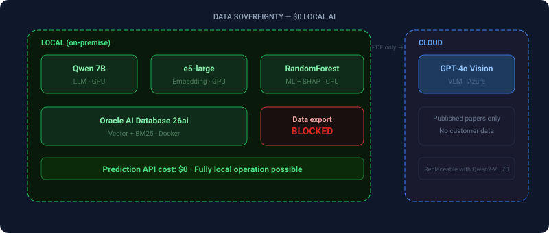
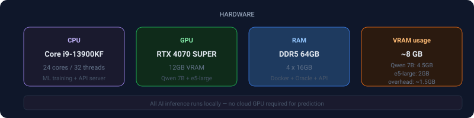

# FieldOps-AI

[English version](README.md)


### [▶ ライブデモ（GitHub Pages）](https://seunghwan-dev.github.io/fieldops-ai/)

DEMOモード — Docker不要。ML Only ↔ Fusionを切り替えて違いを確認できます。

---

## Before / After

<p align="center">
  
</p>

> ML単独では数値だけ。警告も根拠もなし。Fusionはドメイン知識で補正し、出典を提示します。すべての出力は人間の承認を経てから実行されます。

---

## アーキテクチャ

<p align="center">
  
</p>

> クラウドVLMで論文を取り込み、抽出精度を最大化。Track Aはナレッジベースを検索、Track Bは実験データ（CSV）で学習したMLモデルを使用。予測と推論はすべてローカルGPUで完結。データの外部流出なし、APIコストゼロ。

---

## 機能

<p align="center">
  
</p>

> コア機能は3つ。Domain-ML Fusionが根拠を示して予測を補正し、RAGがナレッジベースから即座に回答、VLMが論文PDFから構造化データを抽出します。

---

## 技術スタック

| コンポーネント | 技術 | 選定理由 |
|---------------|------|----------|
| LLM | Qwen 2.5 7B（Ollama、ローカル） | コスト$0、データ主権 |
| VLM | GPT-4o Vision（Azure OpenAI） | テーブル・図の抽出精度が最高 |
| データベース | Oracle AI Database 26ai | Vector + BM25ハイブリッドを単一DBで実現 |
| Embedding | multilingual-e5-large（1024次元） | 日英韓の多言語対応 |
| ML | RandomForest + SHAP | 解釈可能な予測 + XAI |
| フロントエンド | React 19 + TypeScript + Tailwind | EN/JA二言語UI |
| Fusion | LLM Layer + Rule-based Safety | 柔軟性と絶対性を両立する二層構造 |

---

## 主要な設計判断

### 1. 装置A vs B：異なるMLアプローチ

<p align="center">
  
</p>

> 装置Aは物理式が存在しないため、MLが実験報告書から直接学習。装置BにはBond's Lawがあるが、特定のRPM範囲外では誤差が出る。その差分をMLが補正します。

### 2. Fusion：LLMの柔軟性 + Ruleの絶対性

<p align="center">
  
</p>

> Layer 1（LLM）は柔軟に根拠を統合し補正を提案。Layer 2（Rule）はハードコードされた安全ルールで、他のすべての判断に優先します。二層構造で安全性に妥協なし。

### 3. MDSK-RAG Dual-Source Collection

[MDSK-RAGパターン（ACS JCIM）](https://pubs.acs.org/doi/10.1021/acs.jcim.5c01941)を参考に、ナレッジを2つのテーブルに物理的に分離しています。

<p align="center">
  
</p>

> 単一テーブルではテキスト知識と数値データが混在し、検索精度が低下。文献と定量データを物理的に分離し、それぞれに最適なインデックスを構築。実運用では、同じパターンを機密データと公開データの分離にも応用できます。

### 4. データ主権 — 外部API費用 $0のローカルAI

<p align="center">
  
</p>

> すべてのAIコンポーネントはローカルで稼働。唯一のクラウドサービス（VLM）は公開論文のみを処理し、顧客データには一切触れません。ローカルモデルに置き換えれば完全ローカル運用も可能です。

---

## テスト

```bash
docker exec -it fieldops-ai-backend-1 pytest tests/ -v --tb=short
```

| カテゴリ | 件数 | 戦略 | 速度 |
|---------|------|------|------|
| A. Core API | 20 | VLM/LLMモック、DB/MLは実環境 | ~10秒 |
| B. Integration | 10 | 全サービス実環境（Docker必須） | ~60秒 |
| C. Edge Cases | 10 | LLM障害注入（タイムアウト、中国語、不正JSON） | ~15秒 |
| D. Equipment Physics | 10 | Bond's Lawハイブリッド検証 + SHAP + 安全構造 | ~5秒 |
| **合計** | **50** | | |

---

## ハードウェア

<p align="center">
  
</p>

---

## クイックスタート

```bash
git clone https://github.com/seunghwan-dev/fieldops-ai.git
cd fieldops-ai
cp .env.example .env
docker compose up -d
cd frontend && npm install && npm run dev
```

Dockerが停止していると、DEMOモードが自動で有効になります。

---

## ライセンス

MIT
