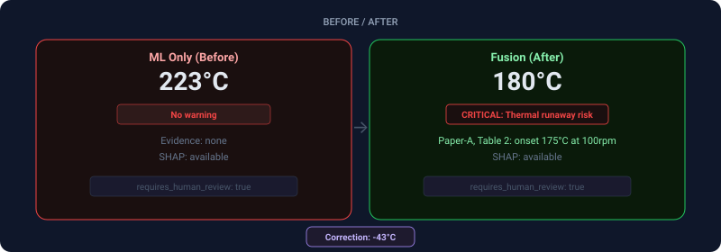
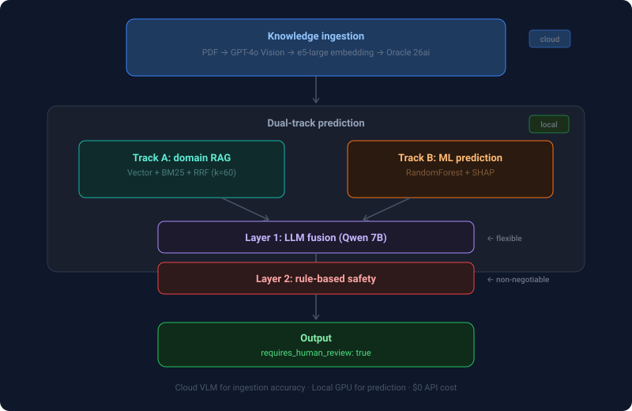
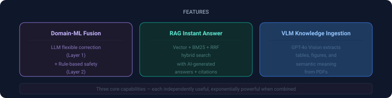
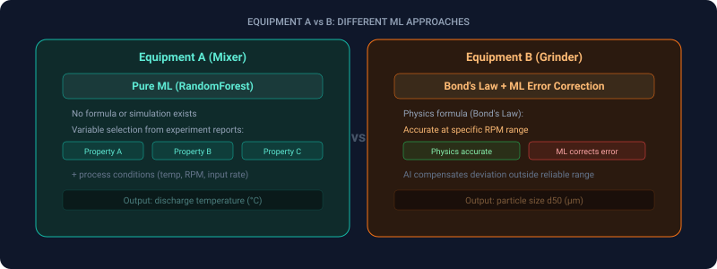
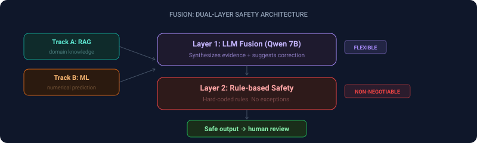
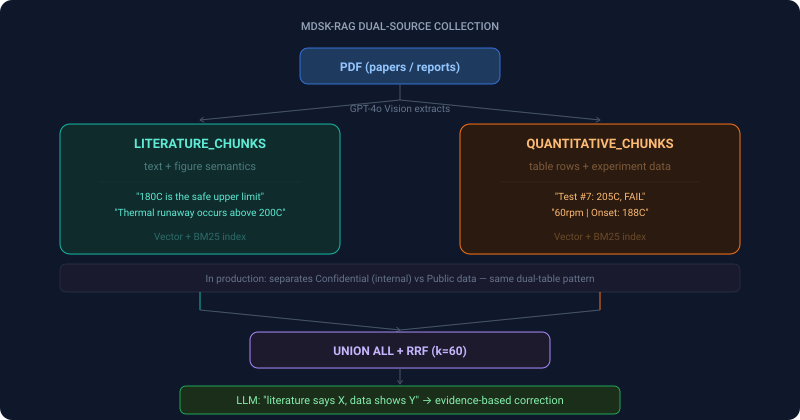

# FieldOps-AI

**Technical Validation — RAG Hybrid Search + Domain-ML Fusion**

> **Disclaimer:** This is a personal project for technical validation and learning purposes. All data used is mock/synthetic data. It contains no real data, parameters, or confidential information from any specific company or product.

[日本語版はこちら](README-ja.md)

### [▶ Live Demo (GitHub Pages)](https://seunghwan-dev.github.io/fieldops-ai/)

DEMO mode — no Docker required. Toggle ML Only ↔ Fusion to see the difference.

---

## Before / After

  

> ML alone outputs a number — no warning, no evidence. Fusion adds domain knowledge correction with cited sources. Every output requires human approval before action.

---

## Architecture

  

> Cloud VLM ingests papers for maximum extraction accuracy. Track A searches the knowledge base; Track B uses ML models trained on experiment data (CSV). All prediction and reasoning runs on local GPU — zero data leaves the building, zero API cost.

---

## Features

  

> Three core capabilities: Domain-ML Fusion corrects predictions with evidence, RAG provides instant answers from the knowledge base, and VLM extracts structured data from research PDFs.

---

## Tech Stack

| Component | Technology | Why |
|-----------|-----------|-----|
| LLM | Qwen 2.5 7B (Ollama, local) | no external API calls, data sovereignty |
| VLM | GPT-4o Vision (Azure OpenAI) | Best table/figure extraction accuracy |
| Database | Oracle AI Database 26ai | Vector + BM25 hybrid in single DB |
| Embedding | multilingual-e5-large (1024d) | JP/EN/KR multilingual support |
| ML | RandomForest + SHAP | Interpretable prediction + XAI |
| Frontend | React 19 + TypeScript + Tailwind | EN/JA bilingual UI |
| Fusion | LLM Layer + Rule-based Safety | Flexible + Non-negotiable dual layer |

---

## Key Design Decisions

### 1. Equipment A vs B: different ML approaches

  

> Equipment A has no physics formula — ML learns directly from experiment reports. Equipment B has Bond's Law, but it deviates outside a specific RPM range — ML corrects the gap.

### 2. Fusion: LLM flexible + Rule non-negotiable

  

> Layer 1 (LLM) is flexible — it synthesizes evidence and suggests corrections. Layer 2 (Rule) is non-negotiable — hard-coded safety limits override everything. Two layers, zero compromise on safety.

### 3. MDSK-RAG Dual-Source Collection

Based on the [MDSK-RAG pattern (ACS JCIM)](https://pubs.acs.org/doi/10.1021/acs.jcim.5c01941), knowledge is stored in two physically separated tables.

  

> A single table mixes text knowledge with numerical data, degrading search precision. Two separate tables — literature and quantitative — allow optimized indexes for each. In production, the same pattern separates confidential from public data.

### 4. Hybrid Chunking with MDSK-RAG Routing

PDF content is split by **content type** rather than fixed token windows:

- **Text** — Paragraph-boundary splits, soft cap 400 tokens (~1,600 chars), no overlap. Section headings preserved as `section_title` metadata.
- **Tables** — Row-level chunks (header + one data row per chunk), formatted as `Table {id} | Header1: Value1 | Header2: Value2 | ...`. Each row is independently retrievable.
- **Figures** — One chunk per figure, combining VLM-generated `semantic_summary` and `key_data_points`. Figure caption stored in `section_title`.

Chunks are routed by type into **two physically separated Oracle tables** (MDSK-RAG):

| chunk_type | Table | Purpose |
|------------|-------|---------|
| `text`, `figure` | `LITERATURE_CHUNKS` | Narrative / explanatory retrieval |
| `table_row` | `QUANTITATIVE_CHUNKS` | Numeric / threshold lookups |

Qualitative queries target the literature table; numeric-condition queries (e.g., "discharge temp > 200°C") target the quantitative table. Both feed the hybrid (vector + BM25 + RRF) pipeline.

## Roadmap

This repository is a technical validation; the items below are designed extensions, not yet implemented.

- **Query rewriting** — rewrite user queries before retrieval to improve recall on under-specified questions
- **CI/CD expansion** — extend the existing secret-scan and Pages-deploy workflows into full test/build automation
- **LLM token & cost tracking** — per-request token accounting across Ollama and Azure
- **Metrics & dashboards** — Prometheus + Grafana for latency, retrieval quality, and fusion confidence
- **TLS reverse proxy** — HTTPS termination for non-localhost deployment
- **Deployment architecture doc** — production topology beyond the local docker-compose stack
